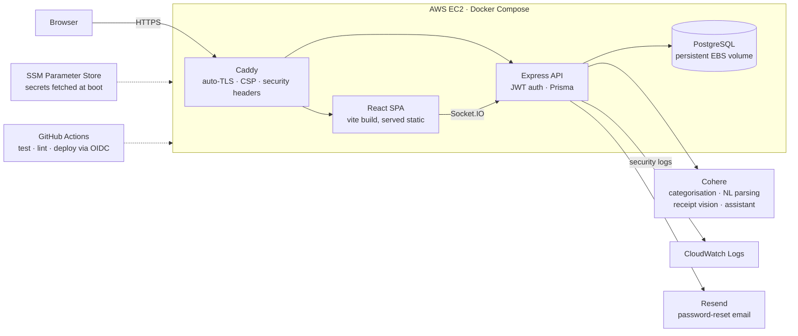

# SplitFinance - A Splitwise-Style Expense Sharing App

A full-stack expense-splitting app: track shared expenses across a group,
let an AI categorise, parse and read them (typed or photographed), ask it
about your balances, and simplify group debt into at most n−1 settlement
payments.

🔗 **Live at [splitfinance.org](https://splitfinance.org)** · API health check: [api.splitfinance.org](https://api.splitfinance.org/health)

React (Vite) · Node/Express · PostgreSQL + Prisma · Socket.IO · Cohere ·
Docker · Terraform on AWS EC2 · GitHub Actions CI/CD


<details>
<summary><b>A group in detail</b> — balances, AI-categorised insights, and the add-expense form</summary>


</details>

> Both images are generated by driving the real app in a browser
> (`e2e/tests/screenshots.spec.js`), so they can't drift from what the app
> actually renders — regenerating them is `npm run screenshots`.

## 🏛️ How it fits together



27 REST endpoints across 8 resources. Full tech stack, package layout, and
subsystem-by-subsystem detail (AI, WebSockets, spending insights, password
reset) are in [docs/ARCHITECTURE.md](docs/ARCHITECTURE.md).

Everything below is the detail — [Features](#-features) first, then the
[algorithm](#-the-interesting-part-debt-simplification) and [money](#-money)
write-ups, then [Getting Started](#-getting-started). Security, testing, the
database schema, and deployment each have their own doc, linked from the
matching section below.

## ✨ Features

- **Auth** — signup/login with hashed passwords and a JWT session held in an
  HttpOnly cookie (never readable by page JavaScript); every account has a
  unique username (letters, numbers, underscores) alongside its email
- **Account Management** — a dedicated Account page (linked from the main
  menu on every page) for updating your name, username, or email, and for
  changing your password (requires the current one)
- **Admin Dashboard** — platform-wide counts (users, groups, expenses,
  settlements, total money moved) and a recent-signups/recent-groups
  glance, gated behind a `User.isAdmin` flag with no self-service way to
  set it (set directly in the database)
- **Password Reset** — a self-service "forgot password" flow: request a
  link by email, click it, set a new password. Reset tokens are single-use,
  expire in 1 hour, and the request endpoint responds identically whether
  or not the email is registered, so it can't be used to check who has an
  account
- **Groups** — create groups, invite members by email *or* username, and
  add more members to a group after it's already been created
- **Expenses** — log, edit, or delete expenses (editor-only), with 3 ways to split
  a bill: equally, by percentage, or by exact amount, and a "Split between"
  checkbox list to include/exclude specific members regardless of split type
- **Auto-Categorization** — expenses are automatically tagged with one of 9 fixed
  categories using Cohere's Chat API
- **Natural-Language Expense Entry** — type something like "Dinner $60, I
  paid, split with Bob and Charlie" and Cohere parses it into the
  add-expense form's fields for you to review before submitting
- **Receipt Scanning** — photograph a receipt and a Cohere vision model reads
  the merchant, total and line items; a splitter then lets you tick who had
  each item, with tax and tip spread in proportion to what each person
  ordered, and fills the add-expense form for you to review
- **Balances & Spending Assistant** — ask "who do I owe the most?" or "how
  much did I spend on food this month?" in a chat box on the dashboard; a
  tool-calling agent answers from your own balances and spending, read-only
- **Balances** — real-time "who owes whom" view per group, plus a
  dashboard rollup of what you owe and are owed by each person across all
  your groups, netted across groups with a per-group breakdown linking to
  where each balance can be settled
- **Debt Simplification** — a graph-reduction algorithm that collapses a tangled
  web of IOUs into at most n−1 transactions for an n-person group
- **Settlements** — record payments between members, right from the balances view;
  the amount starts at the full balance, and editing it down records a
  partial payment
- **Finalize / Reopen** — lock a group to stop new expenses once a trip/bill is
  done, without blocking settling up; any member can finalize or reopen
- **Manual Category Override** — any group member can correct a bad
  auto-categorization from a dropdown, even on a finalized group
- **Spending Insights** — category, time (day/week/month), and per-member/
  per-group breakdowns, both per-group and personally across all your groups;
  every current member appears in the per-member breakdown, even at $0 if
  they haven't been part of an expense yet
- **Search & Filter** — narrow a group's expenses by description text,
  category, payer and date range; balances and insights stay unfiltered so a
  filter can never make someone look like they owe less
- **CSV Export** — download a group's expenses (one column per member) and
  settlements as spreadsheet-safe CSV files
- **Activity Feed** — chronological log of expenses and settlements per group
- **Live Updates** — a WebSocket notice tells you when someone else changes a
  group you're viewing (new/edited/deleted expense, settlement, finalize/
  reopen, new member); the page refreshes itself automatically, with a
  dismissable banner naming who did what

## 🧠 The Interesting Part: Debt Simplification

If Alice owes Bob $10, Bob owes Carol $10, and Carol owes Alice $10, naively
that's 3 transactions — but the net effect is **zero**. This app implements a
greedy cash-flow reduction (`server/src/services/simplifyDebts.js`) that:

1. Computes each member's net balance (total owed − total owing)
2. Repeatedly matches the largest creditor with the largest debtor
3. Settles the whole group in **at most n−1 transactions** for n people

Each pass zeroes out at least one person's balance, which is what
guarantees the n−1 bound — so an O(n²) worst-case payment graph always
collapses to O(n) transactions.

Worth being precise about what this does *not* claim: finding the true
minimum number of transactions is NP-hard (it reduces to partitioning the
balances into as many zero-sum subsets as possible), so this is a
heuristic — the same one Splitwise uses in practice — not a provably
optimal solver. It's guaranteed to settle the group correctly and to stay
within the n−1 bound; it just isn't guaranteed to find the very shortest
possible list of payments in every case.

## 🤖 AI Features (Cohere)

Four Cohere-backed features, all optional - the app works fully without an API
key, each one just falls back or becomes unavailable - and all gated on a
confirmed email address, since a free, instant signup is the cheap route to
someone else's metered quota:

- **Auto-Categorization** - every expense is tagged with one of 9 fixed
  categories from a few-shot prompt over Cohere's Chat endpoint; no key means
  everything falls back to `"Other"`
- **Natural-Language Expense Entry** - "Dinner $60, I paid, split with Bob
  and Charlie" becomes a pre-filled form, never a submitted expense
- **Receipt Scanning** - photograph a receipt and a vision model reads the
  merchant, total and line items; a per-item splitter then spreads tax and tip
  in proportion to what each person ordered, exact to the cent
- **Balances & Spending Assistant** - a tool-calling agent that answers
  questions about your own balances and spending by calling the same services
  the rest of the app already uses, never its own arithmetic; no tool takes a
  user id, so there's no argument a prompt-injection payload sitting in an
  expense description could use to ask for someone else's data

The prompts, the response sanitization, the upload path, and the assistant's
tool boundary are all in
[docs/ARCHITECTURE.md](docs/ARCHITECTURE.md#-ai-features-cohere).

## 🔒 Security

Full detail, including the reasoning behind each one, is in
[docs/SECURITY.md](docs/SECURITY.md). A few highlights:

- Every user id a request supplies - not just the requester's own - is
  checked against group membership before it's trusted
- The session lives in an HttpOnly, SameSite=Lax cookie, never
  `localStorage`; a password change bumps a `tokenVersion` that revokes every
  earlier session immediately, not just at its natural expiry
- Settlements are validated server-side against the same simplified debts the
  UI shows, not a separately-derived balance that can disagree with it
- Structured security event logging that escalates to a warning on repeated
  events, shipped to CloudWatch
- Secrets are fetched from AWS SSM Parameter Store at boot, never baked into
  the EC2 instance's launch config; CI deploys via GitHub OIDC, no stored AWS
  key
- `npm audit` on every change and weekly on a schedule, plus Dependabot
  upgrade PRs that run the full test suite before anyone merges them

## 🚀 Getting Started

### Prerequisites
- Node.js 24 — what CI and all three Docker images use. Node 20 is end-of-life,
  and the frontend test tooling won't run on it at all (vitest 5 needs
  `^22.12 || ^24`, jsdom needs `>=22.22`)
- Docker & Docker Compose

### Setup
```bash
git clone https://github.com/rmeera-projs/splitfinance.git
cd splitfinance

# Start Postgres
docker-compose up -d db

# Backend
cd server
cp .env.example .env
npm install
npx prisma migrate dev --name init
npm run dev

# Frontend (in a new terminal)
cd client
cp .env.example .env
npm install
npm run dev
```

Backend runs on `http://localhost:5000`, frontend on `http://localhost:5173`.

#### Cohere API key (optional)
Auto-categorization, natural-language expense entry, receipt scanning and the
balances assistant all need a [Cohere](https://cohere.com) API key. Add it to `server/.env`:
```
COHERE_API_KEY="your-key-here"
```
This is optional — without it, every expense is categorized as `"Other"`
natural-language entry falls back to a much cruder regex-only parse (see
[expenseParsingService.js](server/src/services/expenseParsingService.js)),
receipt scanning and the assistant are simply unavailable (a 503), but
everything else works normally. No key is needed to run the test
suite; the Cohere client is fully mocked in tests.

#### Resend API key (optional)
Password reset emails need a [Resend](https://resend.com) API key (free
tier, no domain verification required to start — their default
`onboarding@resend.dev` sender works immediately). Add it to `server/.env`:
```
RESEND_API_KEY="your-key-here"
```
This is optional — without it, `forgot-password` still responds
successfully (so it never leaks whether an email is registered), but the
reset link is only logged to the server's console instead of emailed,
which is enough to test the flow locally. No key is needed to run the test
suite; Resend is fully mocked in tests.

Once a domain is verified in Resend (Domains tab in its dashboard — add
the DKIM/SPF/MX records it gives you at your DNS provider), set
`RESEND_FROM_ADDRESS` too so emails send from that domain instead of the
shared `onboarding@resend.dev` testing address:
```
RESEND_FROM_ADDRESS="SplitFinance <noreply@yourdomain.com>"
```

### Run everything with Docker
```bash
docker-compose up --build
```
The `server` container reads its environment from `docker-compose.yml`, not
from `server/.env` — so to enable auto-categorization or real password
reset emails under Docker, put the keys in a `.env` file at the **repo
root** (not `server/.env`) instead:
```
COHERE_API_KEY="your-key-here"
RESEND_API_KEY="your-key-here"
RESEND_FROM_ADDRESS="SplitFinance <noreply@yourdomain.com>"
```
`docker-compose.yml` picks them up via
`${COHERE_API_KEY}`/`${RESEND_API_KEY}`/`${RESEND_FROM_ADDRESS}`
substitution. This root `.env` is git-ignored, same as `server/.env`.

## 🚢 Deploying for real

See [DEPLOYMENT.md](DEPLOYMENT.md) for step-by-step Railway and AWS/Terraform
deployment guides, and the GitHub Actions pipeline that auto-deploys AWS on
every merge to `main` via SSM (no SSH, no stored AWS key). **This is what's
actually running the live deploy** at https://splitfinance.org.

Every migration ships with a rollback path, enforced by two test layers - see
[docs/DATABASE.md](docs/DATABASE.md#migrations) for how that works and how to
use it.

## 🧪 Testing

612 tests across three layers - a fast mocked layer for logic, a real-database
layer for everything mocks structurally can't prove, and a browser layer for
the flows a user actually performs. What each layer catches (with examples) and
full setup instructions for integration/e2e are in
[docs/TESTING.md](docs/TESTING.md).

| Layer | Count | What's real |
|---|---|---|
| Unit | 525 (302 backend, 223 frontend) | the Express app, React components |
| Integration | 70 | Postgres, Prisma, migrations, the whole request path |
| End-to-end | 17 | everything — real browser, real API, real database |

```bash
# Unit - fast, no Docker, no network. Runs on every save.
cd server && npm test        # 302 (Jest + Supertest, Prisma mocked)
cd client && npm test        # 223 (Vitest + React Testing Library)
```

## 💵 Money

Every amount in this app — in the database, over the API, and through every
calculation — is an **integer number of cents**. `$10.23` is `1023`.

Money used to be a JavaScript `number`, and binary floating point can't
represent most decimal fractions exactly (`0.1 + 0.2 === 0.30000000000000004`).
That forced a *tolerance* into the check that an expense's splits summed to its
total — which meant a split genuinely off by up to a cent passed validation.
With integers the same check is exact equality:

```js
if (Math.abs(splitTotal - data.amount) > 0.01)  // before
if (splitTotal !== data.amount)                 // now
```

The other thing integers force you to be honest about is remainders. `$60.50`
three ways is `2016.66…` cents each, which no set of equal whole cents can make
— `splitEvenly` hands the leftover cents out one at a time, so the parts always
reconcile against the total exactly.

Full schema and the money-handling code path: [docs/DATABASE.md](docs/DATABASE.md).

## 🗺️ Roadmap

### Next up
Nothing queued right now - see Later below.

### Later
- [ ] Smart settle-up nudges - reuse `simplifyDebts.js`'s output to
  proactively suggest who should settle up next, phrased in plain language
  ("Alice and Bob settling up clears 2 of the 3 outstanding debts") rather
  than just listing raw balances; would also give the "Email notifications"
  item below actual content worth sending instead of a plain transactional
  email
- [ ] Duplicate-expense detection - flag a newly-added expense that looks
  like an accidental double-entry of a recent one (similar description,
  amount, and date)
- [ ] CAPTCHA on signup/login after repeated attempts - deliberately not
  built yet: it needs a third-party provider and keys, and shipping an
  inert code path waiting for them is worse than not having it. The per-IP
  rate limits, the bulk-signup warnings, and email verification cover the
  same ground for now
- [ ] Recurring expenses (rent, subscriptions)
- [ ] Email notifications on new expenses
- [ ] Multi-currency support - right now every amount is an unlabeled
  number (implicitly one currency); real trips/roommate groups often mix
  currencies

### Shipped
See [docs/CHANGELOG.md](docs/CHANGELOG.md) for the full history, newest first.

## 📄 License
MIT
